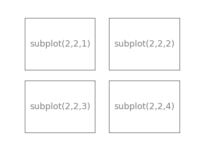
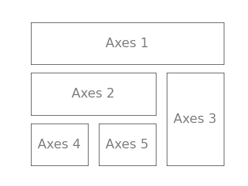
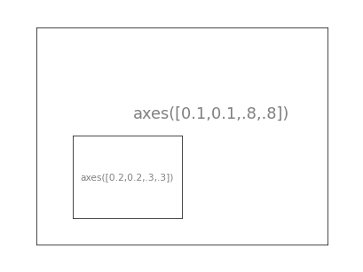
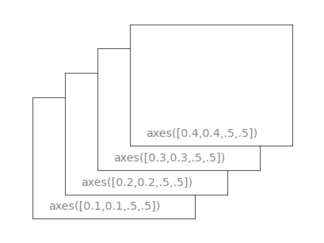

图像, 子图, 坐标轴和记号
========================

在Matplotlib中, 图像指的是用户界面看到的整个窗口内容. 
在图像里面有所谓的子图. 子图的位置是由坐标网格确定的, 而坐标轴却不受此限制, 可以放在图象的任意位置. 

当我们调用\ ``plot()``\ 函数的时候, Matplotlib调用\ ``gca()``\ 函数以及\ ``gcf()``\ 函数来获取当前的坐标轴和图像; 
如果无法获取图像, 则会调用\ ``figure()``\ 函数来创建一个 --- 严格的说, 是调用\ ``subplot(1, 1, 1)``\ 来创建一个只有一个子图的图像. 

图像
^^^^

所谓图像, 就是GUI里以"Figure #"为标题的那些窗口. 
图像的编号从1开始, 与Matlab的风格一致, 而与Python从0开始编号的风格不同.

.. table:: 图像的属性

    ============= ===================== ====================
    参数          默认值                描述
    ``num``       1                     图像的数量
    ``figsize``   ``figure.figsize``    图像的宽和高(英寸)
    ``dpi``       ``figrue.dpi``        分辨率(点/英寸)
    ``facecolor`` ``figure.facecolor``  绘图区域的背景颜色
    ``edgecolor`` ``figure.edgecolor``  绘图区域边缘的颜色
    ``frameon``   ``True``              是否绘制图像边缘
    ============= ===================== ====================

可以使用图像界面中的关闭按钮来关闭窗口, Matplotlib也提供了\ ``close()``\ 函数用来关闭窗口. 
``close()``\ 函数的具体行为取决于提供的参数:

    * 不传递参数: 关闭当前窗口;
    * 传递窗口编号或窗口实例作为参数: 关闭指定的窗口;
    * ``all``\ : 关闭所有窗口.

子图
^^^^

可以使用子图来将图样(plot)放在均匀坐标的网格中.  
使用\ ``subplot()``\ 函数时, 需要指明网格的行列数量, 以及希望将图样放在哪一个网格区域中. 
此外, ``gridspec()``\ 函数的功能更加强大, 也可以选择使用它来实现这个功能.

.. note::

    子图类似Qt中的布局管理器: 将整个窗口按行列分为几个部分, 将图样放在其中的某一部分. 

Example 1:

.. code-block:: python

    from pylab import *

    subplot(2,2,1)
    xticks([]), yticks([])
    text(0.5,0.5, 'subplot(2,2,1)',ha='center',va='center',size=20,alpha=.5)

    subplot(2,2,2)
    xticks([]), yticks([])
    text(0.5,0.5, 'subplot(2,2,2)',ha='center',va='center',size=20,alpha=.5)

    subplot(2,2,3)
    xticks([]), yticks([])
    text(0.5,0.5, 'subplot(2,2,3)',ha='center',va='center',size=20,alpha=.5)

    subplot(2,2,4)
    xticks([]), yticks([])
    text(0.5,0.5, 'subplot(2,2,4)',ha='center',va='center',size=20,alpha=.5)

    # savefig('../figures/subplot-grid.png', dpi=64)
    show()

Example 2:

.. code-block:: python

    from pylab import *
    import matplotlib.gridspec as gridspec

    G = gridspec.GridSpec(3, 3)

    axes_1 = subplot(G[0, :])
    xticks([]), yticks([])
    text(0.5,0.5, 'Axes 1',ha='center',va='center',size=24,alpha=.5)

    axes_2 = subplot(G[1,:-1])
    xticks([]), yticks([])
    text(0.5,0.5, 'Axes 2',ha='center',va='center',size=24,alpha=.5)

    axes_3 = subplot(G[1:, -1])
    xticks([]), yticks([])
    text(0.5,0.5, 'Axes 3',ha='center',va='center',size=24,alpha=.5)

    axes_4 = subplot(G[-1,0])
    xticks([]), yticks([])
    text(0.5,0.5, 'Axes 4',ha='center',va='center',size=24,alpha=.5)

    axes_5 = subplot(G[-1,-2])
    xticks([]), yticks([])
    text(0.5,0.5, 'Axes 5',ha='center',va='center',size=24,alpha=.5)

    #plt.savefig('../figures/gridspec.png', dpi=64)
    show()

坐标轴
^^^^^^

坐标轴和子图的功能类似, 不过它可以放在图像的任意位置. 

子图是将窗口划分为若干个区域, 划分后, 每个区域的位置和大小就是固定的. 
Matplotlib还提供了\ ``axis()``\ 函数, 来指定图样的位置(左下坐标原点的位置)和宽高.

Example 1:

.. code-block:: python

    from pylab import * 
   
    axes([0.1,0.1,.8,.8]) 
    xticks([]), yticks([]) 
    text(0.6,0.6, 'axes([0.1,0.1,.8,.8])',ha='center',va='center',size=20,alpha=.5) 

    axes([0.2,0.2,.3,.3]) 
    xticks([]), yticks([]) 
    text(0.5,0.5, 'axes([0.2,0.2,.3,.3])',ha='center',va='center',size=12,alpha=.5) 

    plt.savefig("/tmp/axes.png",dpi=64) 
    show() 

Example 2:

.. code-block:: python

    from pylab import * 
   
    axes([0.1,0.1,.5,.5]a) 
    xticks([]), yticks([]) 
    text(0.1,0.1, 'axes([0.1,0.1,.5,.5])',ha='left',va='center',size=16,alpha=.5) 

    axes([0.2,0.2,.5,.5]) 
    xticks([]), yticks([]) 
    text(0.1,0.1, 'axes([0.2,0.2,.5,.5])',ha='left',va='center',size=16,alpha=.5) 
   
    axes([0.3,0.3,.5,.5]) 
    xticks([]), yticks([]) 
    text(0.1,0.1, 'axes([0.3,0.3,.5,.5])',ha='left',va='center',size=16,alpha=.5) 
  
    axes([0.4,0.4,.5,.5]) 
    xticks([]), yticks([]) 
    text(0.1,0.1, 'axes([0.4,0.4,.5,.5])',ha='left',va='center',size=16,alpha=.5) 

    plt.savefig("/tmp/axes-2.png",dpi=64) 
    show()

记号
^^^^

这里的记号(tick), 指的是坐标轴的刻度标识. 
良好的记号是图像的重要组成部分. 

Matplotlib中的记号系统里的各个细节都是可以由用户个性化配置的. 

