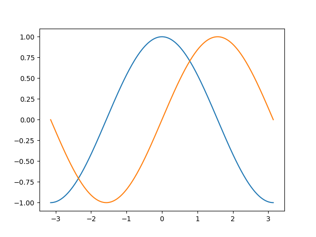
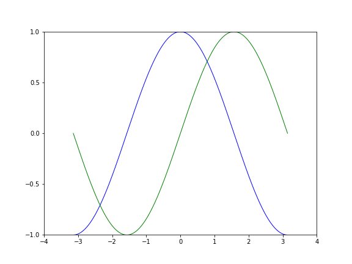

初级绘制
--------

使用默认配置
^^^^^^^^^^^^

Matplotlib的默认配置都允许用户自定义. 
你可以调整大多数的配置: 图片的大小和分辨率(dpi), 线宽, 颜色, 风格, 坐标轴, 坐标轴以及网格的属性, 文字与字体属性等. 
不过, Matplotlib的默认配置在大多数情况下已经做的足够好, 可能只在很少的情况下才会想更改这些默认配置.

Example:

.. code-block:: python

    import numpy as np
    import matplotlib.pyplot as plt

    X = np.linspace(-np.pi, np.pi, 256, endpoint=True)
    C, S = np.cos(X), np.sin(X)

    plt.plot(X, C)

    plt.show()

默认配置的具体内容
^^^^^^^^^^^^^^^^^^

下面的配置包含了有关绘图样式的所有配置, 可以在交互式模式中修改其中的值来观察效果.

.. code-block:: python

    # 导入Matplotlib的所有内容
    from pylab import *

    # 创建一个8 * 6点(point)的图, 并设置分辨率为80
    figure(figsize=(8, 6), dpi=80)

    # 创建一个新的1 * 1的子图, 接下来的图样绘制在其中的第1块(也是唯一的一块)
    subplot(1, 1, 1)

    X = numpy.linspace(-np.pi, np.pi, 256, endpoint=True)
    C, S = numpy.cos(X), numpy.sin(X)

    # 绘制余弦曲线, 使用蓝色的, 连续的, 宽度为1(像素)的线条
    plot(X, C, color='blue', linewidth=1.0, linestyle='-')

    # 绘制正弦曲线, 使用绿色的, 连续的, 宽度为1(像素)的线条
    plot(X, S, color='green', linewidth=1.0, linestyle='-')

    # 设置横轴的上线限
    xlim(-4.0, 4.0)

    # 设置横轴记号
    xticks(numpy.linspace(-4, 4, 9, endpoint=True)

    # 设置纵轴的上下限
    ylim(-1.0, 1.0)

    # 设置纵轴记号
    yticks(numpyy.linspace(-1, 1, 5, endpoint=True)

    # 以分辨率72来保存图片, 默认保存在当前路径下
    # savefig("exercise_2.png", dpi=72)

    # 在屏幕上显示
    show()

改变线条的颜色和粗细
^^^^^^^^^^^^^^^^^^^^

在使用\ ``plot()``\ 函数画图时, 通过\ ``color``\ , ``linewidth``\ 和\ ``linestyle``\ 参数来设置线条的颜色, 线宽和线条的风格.

Example:

.. code-block:: python

    ...
    plot(X, C, color='blue', linewidth=2.5, linestyle='-')
    plot(X, C, color='red',  linewidth=5.0, linestyle='-')

改变图片边界
^^^^^^^^^^^^
    
通过\ ``xlim()``\ 和\ ``ylim()``\ 函数分别设置横轴和纵轴的边界.

设置记号
^^^^^^^^

通过\ ``xticks()``\ 和\ ``yticks()``\ 函数分别设置横轴和纵轴上的记号.

Example:

.. code-block:: python

    xticks([-np.pi, -np.pi/2, 0, np.pi/2, np.pi])
    yticks([-1, 0, 1])

 
设置记号的标签
^^^^^^^^^^^^^^

设置记号的时候, 可以同时设置记号的标签. 注意这里使用了LaTex.

Example:

.. code-block:: python

    xticks([-np.pi, -np.pi/2, 0, np.pi/2, np.pi], 
           [r'$-\pi$', r'$-\pi/2$', r'$0$', r'$+\pi/2$', r'$+\pi$']
    yticks([-1, 0, +1],
           [r'$-1$', r'$0$', r'$+1$'])

移动脊柱
^^^^^^^^

添加图例
^^^^^^^^

可以在使用\ ``plot()``\ 函数绘图时, 使用\ ``label``\ 参数添加图例; 
通过\ ``legend()``\ 函数设置图例的位置.

Example:

.. code-block:: python

    plot(X, C, color='blue', linewidth=2.5, linestyle='-', label='cosine')
    plot(X, S, color='red',  linewidth=2.5, linestyle='-', label='sine')

    legend(loc='upper left')

